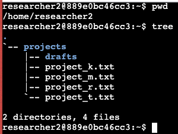
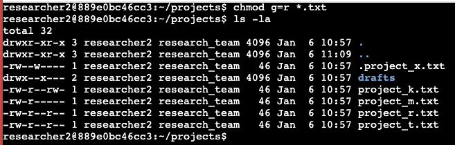
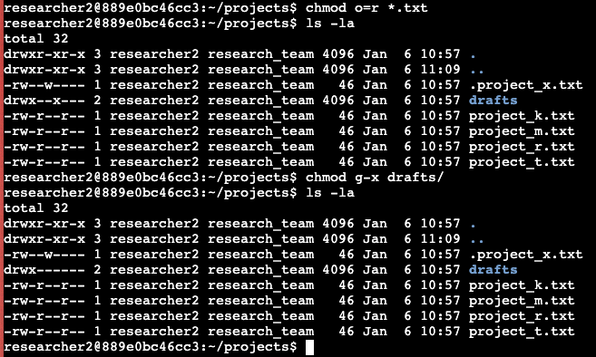
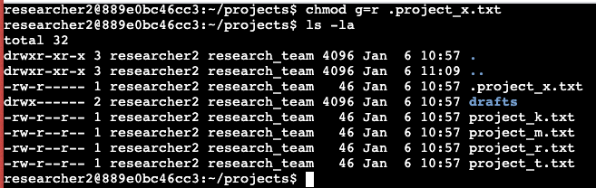

# File permissions in Linux

## Project description
This project involves examining and modifying file and directory permissions within the `/home/researcher2` directory. It begins by identifying the current working directory with `pwd` and listing its contents with `tree`. The project explores the structure of file permissions using `ls -la`, detailing how permissions are assigned to the user, group, and others. It then demonstrates how to adjust these permissions using `chmod`, specifically setting group permissions to read-only for `.txt` files, and explains the process for directories and hidden files.

## Check file and directory details
To start this project we need to locate where we are and the file we are going to work with. First we execute the command `pwd` to see the path of the working directory and then we `tree` the `/home/researcher2` subfolder to see the files on it.

## Change file permissions
Permissions can be changed with the `chmod` command. The command expects 2 arguments: the first argument sets the permissions and the second argument sets the file or files to alter. In the example below, `chmod g=r *.txt` sets the group permissions to only read (`g=r`) for every text file (`*.txt`) in the folder. Note: Hidden files are not affected with this command.

## Change directory permissions
To change directory permissions, we use the same method as above. Instead of using a file or files as the second argument, we use just the directory name and execute the command with the same syntax.

## Change file permissions on a hidden file
To change permissions on a hidden file, the command `chmod g=r *.txt` does not work. Thus, we need to use `chmod g=r .hidden_file.txt` directly to change its permissions.

## Summary
This project examines the file structure and permissions within the `/home/researcher2/projects` directory. It lists five files (`project_k.txt`, `project_m.txt`, `project_r.txt`, `project_t.txt`, `project_x.txt`) with varying permissions for user, group, and others, ranging from read, write, to execute. Additionally, there is a subdirectory named `drafts` with permissions set to read, write, and execute for the user and group, but none for others. The document provides a detailed overview of how permissions are assigned, highlighting the differences in access rights for different users and groups.
