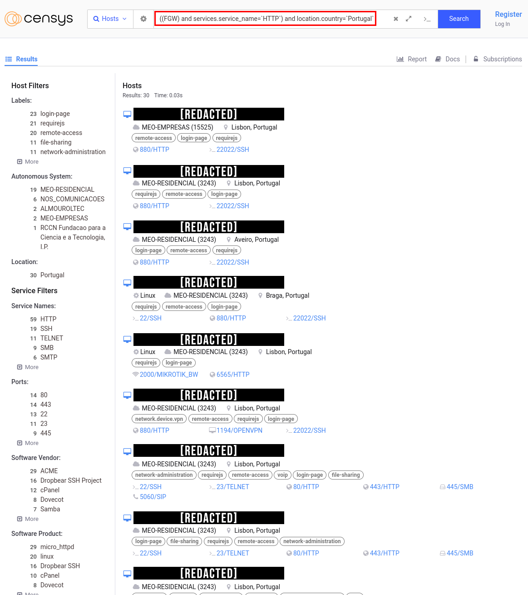
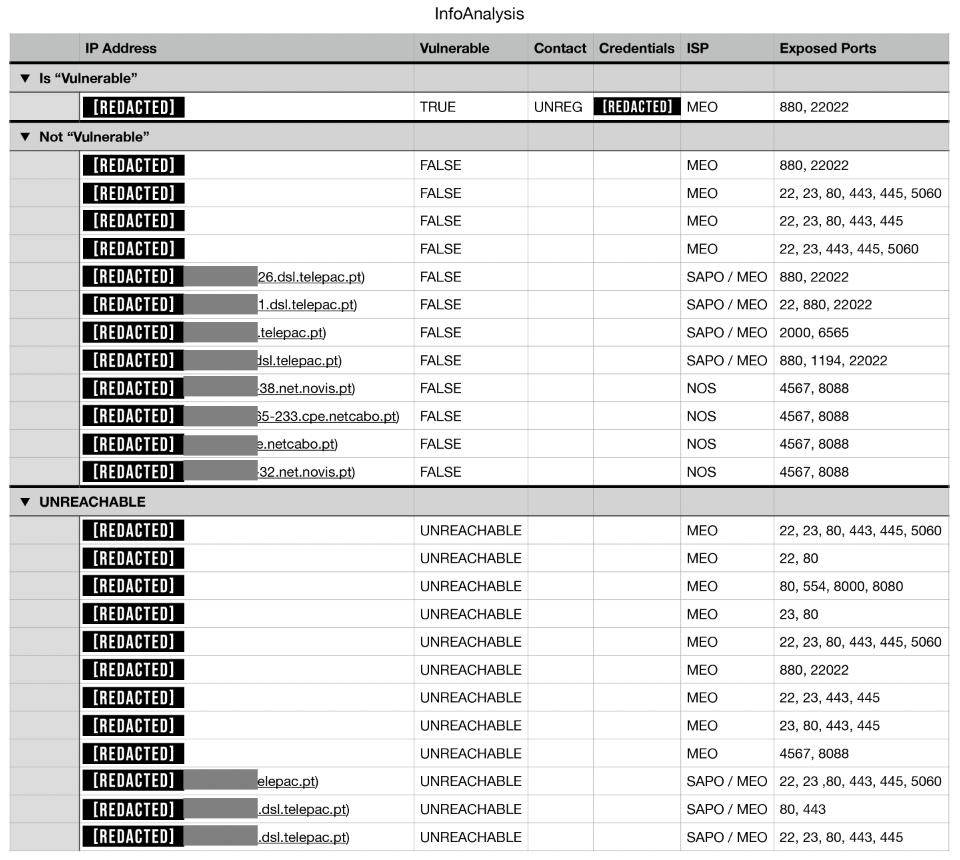
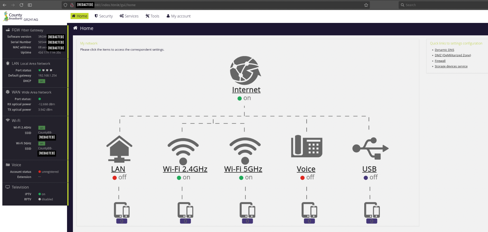
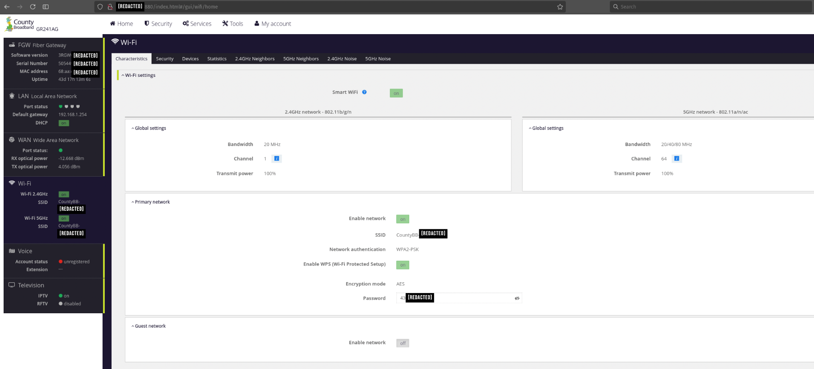
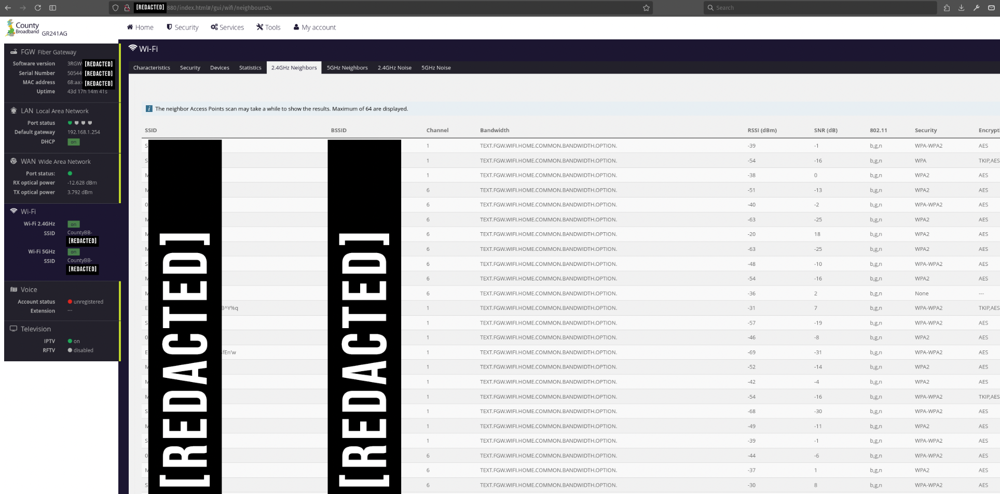
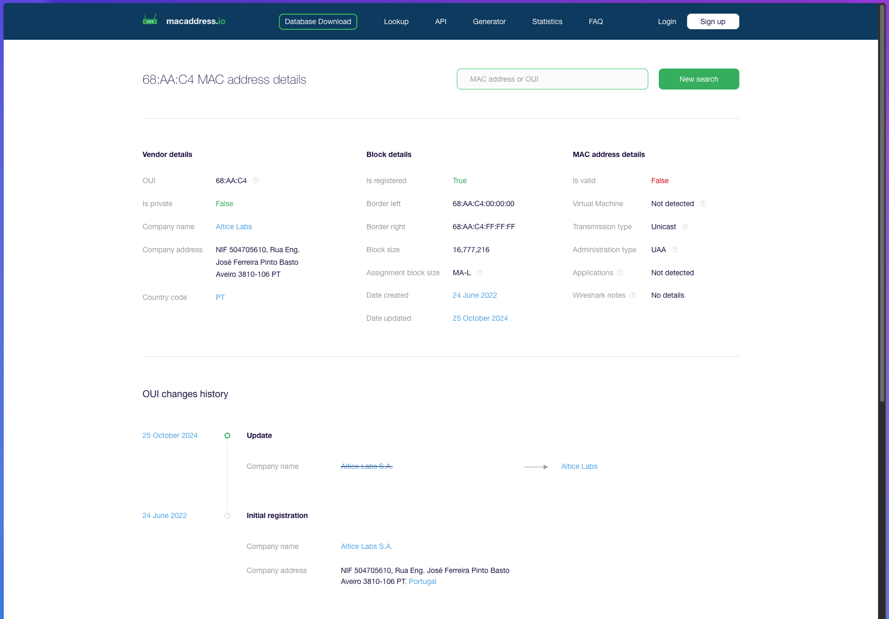
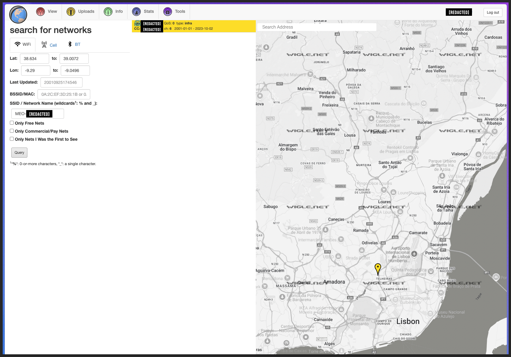
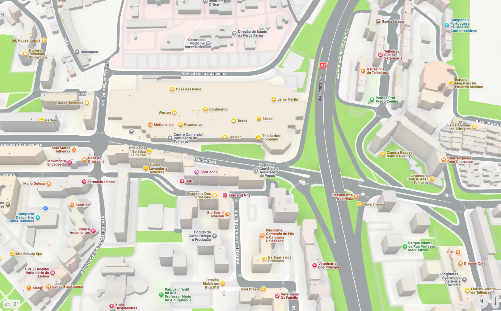

# Cybersecurity Research on Portuguese MEO Routers

## Introduction

I embarked on this research after discovering the capabilities of tools like Censys, which crawls the web and indexes pages based on multiple parameters, including the headers of websites. My curiosity was piqued by the potential of filtering based on specific headers.

## Methodology

### Step 1: Formulating the Search Query

- **Search Criteria**: 
  - Included the word `FGW` in the header, which is typical for MEO routers.
  - Specified the location within Portugal.
  
- **Background Knowledge**:
  - MEO routers typically have their gateway at `192.168.1.254`.
  - All clients share the same login page with default credentials `meo:meo` unless modified from factory settings.
  - Standard SSID format for these routers is `MEO-XXXXX`, where `X` is alphanumeric.

### Step 2: IP Address Collection

- Used Censys to gather a list of IP addresses with the matched search criteria exposed to the internet.

### Step 3: Default Credentials Verification

- Attempted to log in to each identified IP with the default credentials.
- Most addresses led to login pages with altered credentials, except for one.

### Step 4: Anomaly Detection

- One IP address led to a "County Broadband" login page, structurally similar to a MEO FiberGateway but configured differently.
- Raised suspicions of a potential honeypot.
- Despite this, the login was successful using default credentials, but no registered landline was found, complicating owner notification.

### Step 5: Network Analysis

- Accessed the system's dashboard:
  - No devices were connected via WiFi or LAN, which was unusual as there should have been at least one connection on LAN 1.

### Step 6: Neighbor Network Scan

- Conducted a scan for neighboring WiFi networks to gather SSIDs and MAC addresses.

### Step 7: MAC Address Confirmation

- Closed the connection and analyzed the MAC address, confirming it was a MEO/Altice device.

### Step 8: Geo-Location Triangulation

- Used wigle.net to correlate the SSIDs of nearby networks:
  - This led to a triangulation to Telheiras, Lisbon.
- A map search confirmed the area as a commercial zone, making further pinpointing difficult.

## Conclusion

The research successfully identified one vulnerable MEO router out of 23 checked, highlighting the risks of default credentials in internet-exposed devices. The inability to find the exact location or owner due to the commercial nature of the area where the device was identified emphasizes the challenges in security notifications and the need for automated or better response systems for such vulnerabilities.
