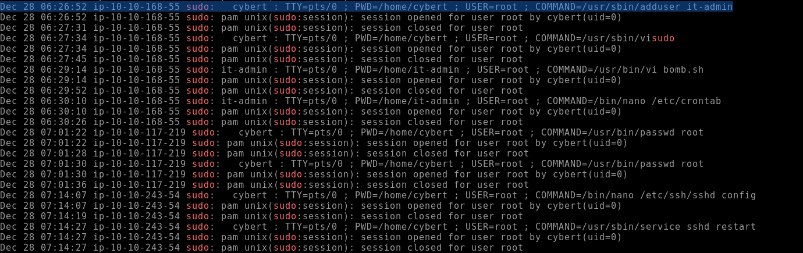

# THM Room: [https://tryhackme.com/r/room/disgruntled](https://tryhackme.com/r/room/disgruntled)

## THM Room Description
Use your Linux forensics knowledge to investigate an incident.

## Introduction
This room simulates an attack on a client (CyberT) by an employee who got arrested. He ran a successful fishing operation as a side gig. CyberT wants us to check if this person has done anything malicious to any of their assets.

## Step-by-Step Operations

### Step 1: Connecting to the machine
We start by accessing the machine \[MACHINE_IP\] by connecting via ssh with the credentials `root:password`.

### Step 2: Checking the logs for malicious commands
We can firstly check if the user ran any commands using elevated privileges by analyzing the logs on `/var/log/auth.log`. This file shows us the authentication logs as well as commands ran using sudo or root.
Instead of using `cat` to concatenate the entire file, let's use a command to filter for a pattern, in this case sudo commands.

We can analyze the first command executed by the user `cybert` on Dec 28th @ 06:17:30. The command shows an installation of the `dokuwiki` package on the user's home directory `/home/cybert`. We can assume the employee knew a vulnerability using dokuwiki.

The next command used was the `chown www-data:www-data /usr/share/dokuwiki` to change the owner of the directory `/usr/share/dokuwiki` from `root` to `www-data`. Furthermore we can see multiple `chown` commands to change the ownership of directories and files

### Step 3: Analyzing the commands executed
At 06:26:52 the `cybert` user returns using another elevated privileged command to create a new user `it-admin`, then uses `visudo` (used to edit the sudoers file) to change sudo permissions of the `cybert` and `it-admin` users.

By analyzing the `.bash_history` file present on the `/home/it-admin` directory we can see that the employee transferred a file `bomb.sh` from another machine, edited it and added a scheduled task to run every 8 hours to the `/etc/crontab` named as `/bin/os-update.sh`.

---

The file scheduled to run will remove the `/var/lib/dokuwiki` directory and all its files and output a taunting message from `mistermeist3r` to the root directory `/goodbye.txt`.
